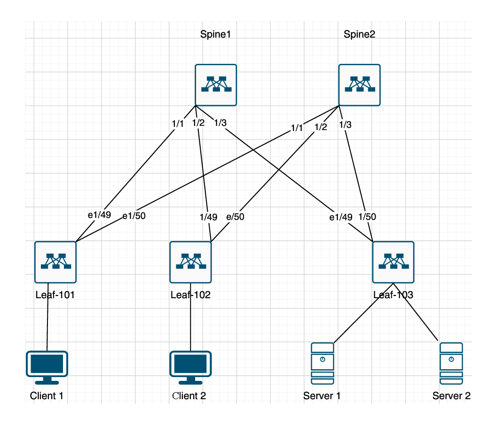

## Сеть CLOS

## Таблица адресов

### 1. Connectivity between Spines and Leafs

|        | Leaf-101  |  Leaf-102 | Leaf-103  | 
|--------|-----------|-----------|-----------|
| spine1 | E1/1-E1/49|E1/2-E1/49 |E1/3-E1/49 | 
| spine2 | E1/1-E1/50|E1/2-E1/50 |E1/3-E1/50 | 

### 2. IP between Spine and Leafs (10.10.25.0/24)

|        |  Leaf-101     | Leaf-102       | Leaf-103       | 
| ------ | ------------- | -------------- | -------------- | 
| spine1 | 10.10.25.0/30 | 10.10.25.8/30  | 10.10.25.16/30 | 
| spine2 | 10.10.25.4/30 | 10.10.25.12/30 | 10.10.25.20/30 | 

### Реализовать схему

